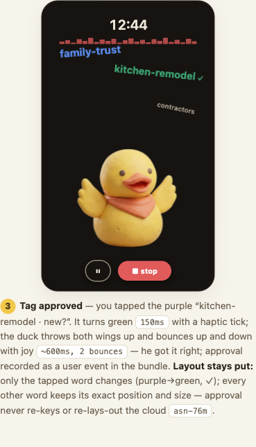
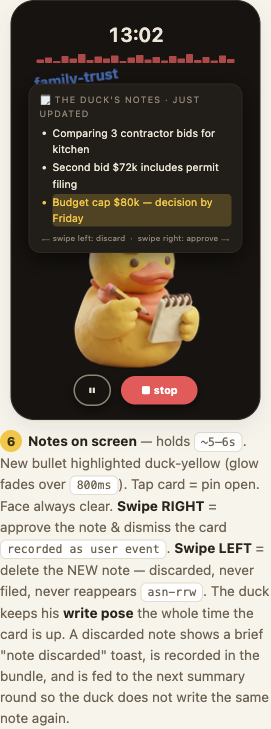
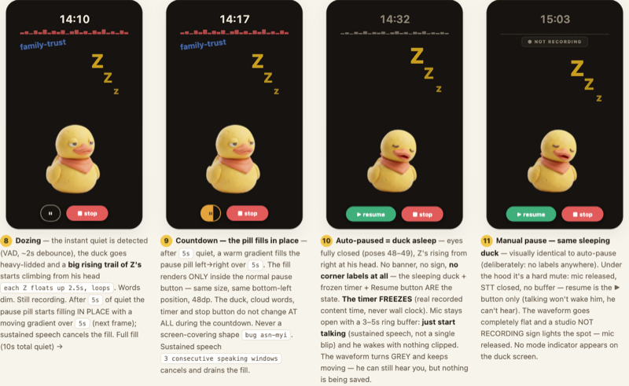

# rubberduck

[](https://github.com/dobromirmontauk/voice-capture-android/actions/workflows/ci.yml)

**Someone to talk to, so you can think.**

Your best ideas show up on a walk, a drive, in the shower — and evaporate
before you get anywhere to write them down. rubberduck fixes that: you talk,
a claymation rubber duck listens, and everything you say ends up organized in
your own notes, tagged and summarized, without you touching a keyboard.

## How it works

Tap record and start talking. rubberduck streams your voice to a live
transcriber as you go, so the duck on screen is always caught up with you —
no waiting, no "processing." Every so often it summarizes what you've said
into a running set of notes, and it's always watching for new subjects so it
can label them for you. When you stop, the session — audio, transcript, tags,
notes — uploads straight into a git-backed vault of Markdown files, where a
follow-on pipeline files it into the right place. A few minutes later you can
open Obsidian and find your kitchen-remodel ramblings sitting under
`kitchen-remodel.md`, summarized, tagged, and linked to everything else you've
ever said about it.

```
   talk it out              the duck listens              filed for you
┌───────────────┐         ┌───────────────────┐        ┌──────────────────┐
│  walk / drive │  ──▶    │ live transcript +  │  ──▶   │ Obsidian vault,  │
│  press record │         │ topic tags + notes │        │ tagged & summar- │
└───────────────┘         └───────────────────┘        │ ized, git history │
                                                          └──────────────────┘
```

Nothing is ever silently dropped: audio is written to a crash-safe log the
instant it's captured, before transcription or tagging ever see it, so a
killed app or a dead phone loses at most a second of sound.

## The duck is the interface

The whole point of rubberduck is that talking to it should feel like talking
to *something*, not filling out a form. The Listen screen is built entirely
around a claymation duck who reacts to you in real time — this is the primary
surface of the app, not a decoration on top of a transcript view.

**He's listening, visibly.** While you talk, the duck blinks every couple of
seconds as audio streams in and nods when a chunk of transcription lands.
Between beats he's still — motion is punctuation, not fidgeting. A thin live
waveform under the timer is the "yes, I can hear you" signal, and a
soft-edged cloud of topic words floats around him, each word sized by how
confident the app currently is that it matters and colored by its status:
blue for a tag you've already got, purple for something new the duck thinks
you're onto, green for something you've confirmed.

**New topics arrive as ideas, not database rows.** The moment the app spots a
subject worth naming, the duck raises a wing eagerly and the word gets
*written* into existence — letter by letter, in a handwritten scrawl — before
it settles into type and drifts into the cloud with the rest.

<p align="center">
  
  
</p>

Tap a purple "new?" word to confirm it's really a topic, and the duck
throws both wings up and bounces with joy — he got it right. Every other word
in the cloud holds its exact position; approving one tag never re-shuffles
the rest.

<p align="center">
  
</p>

**He takes notes, and shows you his work.** Roughly once a minute the duck
switches into a writing pose and a notes card slides in over the word cloud
— never covering him — with the latest summary bullets, the newest one glowing
duck-yellow. Swipe right to approve a note; swipe left to discard it, and
rubberduck remembers that discard so the same note doesn't come back next
round.

<p align="center">
  
</p>

**Silence is handled honestly, not hidden.** Stop talking for a few seconds
and the duck gets heavy-lidded with a rising trail of Z's — still recording,
just noting that it's quiet. Stay quiet long enough and a warm gradient fills
the pause pill in place (nothing else on screen moves); if you keep talking
it drains back out. Let it fill all the way and the duck actually falls
asleep: the timer freezes, but the mic keeps a few seconds of buffer so
picking the conversation back up loses nothing. Tap pause yourself and you
get the same sleeping duck, except it's a hard mute this time — talking
won't wake him, only the Resume button will. The live waveform tells you
which is which even with your eyes half on the road: **red** while recording,
**grey** while auto-paused (he can still hear you, just isn't saving), and
**flat with a "NOT RECORDING" sign** when you've paused manually.

<p align="center">
  
</p>

**Full transparency on demand.** Double-tap the duck any time to drop into a
debug view with the live transcript, per-tag chips, and real-time latency
readouts for every stage of the pipeline (mic → transcript, transcript →
tags, tag scoring) — useful for trusting the app, or for us building it.

*The duck-centric Listen screen above (thought cloud, handwritten tag entry,
notes-card swipes, sleep states) is the locked design as of the v5.3
storyboard and is under active implementation; the recording, live
transcription, tagging, and upload pipeline it sits on top of is built and
working today.*

## The organize loop

The app itself stays deliberately dumb: it never tries to be smart about what
you said, it just makes sure nothing you said is ever lost. Every session —
raw audio, verbatim transcript, live tags, approved notes — uploads as one
commit to a git-backed vault repo over plain HTTPS (no git on the phone). From
there, a separate pipeline (Claude Code skills, running against the vault)
does the actual thinking: transcribes a clean second pass, splits the session
by topic, merges it into the right Markdown notes, and keeps a hierarchical
tag tree so "kitchen remodel" today lands next to "kitchen remodel" from last
month. The result opens cleanly in Obsidian, with full history and
provenance, so you can trust it the way you'd trust your own notes.

---

## Build

```
./gradlew assembleDebug
./gradlew test
```

Requires a JDK compatible with Android Gradle Plugin 8.7 (JDK 17 or 21 --
newer JDKs are not yet supported by AGP; see "Toolchain notes" below if
`./gradlew` picks the wrong one).

## Testing without a working microphone (debug builds only)

The macOS emulator's host-mic passthrough is unreliable (it delivers a few
seconds of real audio, then goes silent), which makes it hard to exercise
live transcription end-to-end from Android Studio. `AudioEngine` captures
from an `AudioSource` interface rather than `AudioRecord` directly (see
`audio/AudioSource.kt`), so a debug-only `FileAudioSource` can stand in for
the mic and feed a recording session from a WAV file instead -- WAL, live
transcript, mic-level meter, and tag chips all behave exactly as they
would with a real mic, and the recording screen's source chip shows `FILE`
instead of `PHONE MIC`/`BLUETOOTH` so it's obvious which one is active. A
handful of bundled fixtures (`app/src/debug/assets/fixtures/`, all 16kHz
mono WAVs) ship in every debug build only -- never in release. See the
table below for what each one covers.

**From the emulator UI (no adb needed):** long-press the "New Session" tab
in the bottom nav. A picker lists the bundled fixtures; pick one and
recording starts immediately, fed from that file instead of the mic.

**Scripted, no Android Studio:** `scripts/emulator-smoke.sh` boots a
headless emulator, drives exactly this fixture-picker flow, and asserts the
finalized bundle against the ingest contract -- see
`docs/emulator-harness.md`.

| Fixture (picker label) | File | Duration | Topic ground truth |
| --- | --- | --- | --- |
| Kitchen remodel | `kitchen-remodel.wav` | ~26s | kitchen remodel |
| Marathon training | `marathon-training.wav` | ~28s | marathon training |
| Dog walk download | `dog-walk-download.wav` | ~3m41s | kitchen remodel, work launch, vacation -- single-topic phases with a return to the remodel decision after the launch/vacation detour (bead vn-edu.39) |
| Drive home | `drive-home-hiring.wav` | ~3m45s | hiring decision (dominant, whole clip) -- dinner plans and car noise are brief digressions that should *not* earn their own topic chip; the single-strong-tag test case (bead vn-edu.39) |

The two long-form fixtures exist to exercise topic-chip dynamics (growth,
reordering, shrinking) that only show up once a session runs several
minutes and drifts across multiple major topics with natural transitions,
filler, and a few multi-second pauses (`say`'s `[[slnc N]]`). Their source
scripts -- the exact text fed to `say`, and the ground truth for what's
said and when the pauses land -- are committed alongside the WAVs as
`<name>.txt` in the same `app/src/debug/assets/fixtures/` directory, and
`scripts/generate-fixtures.sh` regenerates any fixture's WAV from its `.txt`
(macOS `say` + `afconvert`, pinned to the `Samantha` voice for reproducible
regeneration).

**From the command line, injecting your own file:** push any 16kHz mono
16-bit PCM WAV to the device and pass its path as the `inject_audio` extra
on the start action:

```
adb push my-test-clip.wav /sdcard/my-test-clip.wav
adb shell am start-foreground-service \
  -a com.montauk.voicecapture.action.START \
  -e inject_audio /sdcard/my-test-clip.wav \
  com.montauk.voicecapture/.service.RecordingService
```

Either path only works in a debug build (`FileAudioSource` is never wired up
when `BuildConfig.DEBUG` is false, regardless of what extras a crafted
intent carries). Recording continues normally once the file is exhausted --
end-of-file behaves like silence rather than stopping the session, so tap
Stop in the app when you're done. Non-16kHz-mono or non-16-bit WAVs fail
fast with a clear exception instead of silently misdecoding.

## Configuring secrets for the live demo

Both live transcription and bundle upload are optional at runtime -- with no
key configured, recording still works end to end (WAL -> `audio.ogg`,
session list, upload-state chip just never leaves `LOCAL`). To turn them on,
add these keys to `local.properties` (gitignored, never committed):

```properties
sdk.dir=/path/to/android-sdk
assemblyai.apiKey=<your AssemblyAI API key>
anthropic.apiKey=<your Anthropic API key>
github.token=<a fine-grained PAT scoped to dobromirmontauk/voice-vault>
# optional overrides, default to the values below:
vault.owner=dobromirmontauk
vault.repo=voice-vault
```

Each key also has an environment-variable fallback for one-off builds
without writing a secret to disk (`local.properties` wins if both are set):

```
ASSEMBLYAI_API_KEY=... ANTHROPIC_API_KEY=... GITHUB_TOKEN=<your fine-grained PAT> ./gradlew assembleDebug
```

**`github.token` (bead vn-edu.30): a fine-grained PAT scoped to just the
vault repo is the only recommended token shape**, for this file and for the
in-app "Use an access token" flow described below. A classic PAT or a broad
OAuth token (e.g. `gh auth token`, which carries `repo` scope across every
repo the account can see) still works -- the uploader only ever needs Git
Data + LFS calls against one repo -- but it reaches far more than this app
needs, and the app's login screen will flag one of those as over-scoped on
sign-in. To mint the recommended token:

1. github.com -> Settings -> Developer settings -> Personal access tokens ->
   Fine-grained tokens -> Generate new token.
2. Resource owner: `dobromirmontauk`.
3. Repository access: Only select repositories -> `voice-vault`.
4. Permissions -> Repository permissions -> Contents: **Read and write**.
   Nothing else is needed.

**Precedence (bead vn-edu.48):** `local.properties`/`BuildConfig.GITHUB_TOKEN`
is a dev-build convenience only -- it's what a fresh `./gradlew assembleDebug`
falls back to when nothing else is configured. Any token entered in the app
itself (the login screen's device-flow or "Use an access token" path,
persisted via `AppSecretsStore.userGithubToken`) always wins over it at
runtime; see `AppSecretsStore.effectiveGithubToken()`. The same precedence
rule applies to `assemblyai.apiKey`/`anthropic.apiKey` and their in-app
Settings equivalents.

**Debug-only embedding (bead vn-edu.53):** the `local.properties`/env
convenience above is wired into the **debug** build type only. Release
builds always get `""` for `ASSEMBLYAI_API_KEY`/`ANTHROPIC_API_KEY`/
`GITHUB_TOKEN` in `app/build.gradle.kts`, regardless of what's on the
building machine -- so a release APK never carries real credentials, and
anyone running it must configure keys in-app. Two checks guard this:
`ReleaseSecretsBlankTest` (`app/src/testRelease/`, runs under
`./gradlew test`) asserts the release variant's `BuildConfig` fields are
blank, and `./gradlew checkReleaseSecretsAbsent` assembles a release APK and
string-scans its contents for whatever secrets are actually configured
locally, skipping gracefully when none are (e.g. CI, which never checks in
`local.properties`).

## Architecture

```
com.montauk.voicecapture
├── audio/
│   ├── OpusFrameWal.kt    append-only, crash-safe log of encoded Opus packets
│   ├── AudioSource.kt     start/read/stop PCM interface -- AudioEngine and everything
│   │                      downstream is agnostic to where the PCM comes from
│   ├── MicAudioSource.kt  AudioSource backed by a real AudioRecord (production path)
│   ├── FileAudioSource.kt debug-only AudioSource that paces a decoded WAV file in
│   │                      real time instead of a live mic -- see "Testing without a
│   │                      working microphone" above
│   └── AudioEngine.kt     AudioSource -> MediaCodec (Opus) -> OpusFrameWal;
│                          finalizes a WAL into a playable audio.ogg via MediaMuxer
├── session/
│   ├── SessionId.kt       YYYY-MM-DD_HHMM_<4 random lowercase alnum> ids
│   ├── SessionMeta.kt     meta.json schema (mirrors the voice-vault ingest contract)
│   └── SessionStore.kt    owns files/sessions/<id>/ on disk: create, finalize,
│                          list, and recover sessions orphaned by a process death
├── service/
│   ├── RecordingService.kt   foreground service (microphone type), persistent
│   │                         notification with elapsed time + Stop action
│   └── RecordingState.kt     publishes recording state to the UI
├── stt/
│   ├── StreamingSttClient.kt          interface + factory (real impl vs. no-op by API key)
│   ├── AssemblyAiStreamingSttClient.kt  AssemblyAI Universal-Streaming v3 WebSocket client
│   └── TurnMessage.kt                 wire-format parsing, no OkHttp dep -- plain JVM testable
├── tags/
│   ├── TagTracker.kt         pure-Kotlin confidence ranking/hysteresis/decay, store 10 show <=3
│   ├── TagScorer.kt          pluggable scoring interface
│   ├── HeuristicTagScorer.kt  keyless noun-phrase-ish fallback, no network
│   ├── AnthropicTagScorer.kt  Claude Haiku via the Messages API, degrades to the heuristic
│   ├── TagCoordinator.kt     rolling-tail + scorer-cadence glue in front of TagTracker
│   └── TagsEventLine.kt      `{"event":"tags",...}` live-transcript.jsonl event line
├── upload/
│   ├── BundleUploader.kt          interface + factory (real impl vs. no-op by token)
│   ├── GitHubBundleUploader.kt    Git Data API + Git LFS batch API, one commit per session
│   ├── GitHubLfsPointer.kt        LFS oid/sha256 + pointer-file text, no OkHttp dep
│   ├── GitHubApiModels.kt         minimal request/response shapes for both GitHub HTTP surfaces
│   └── UploadWorker.kt            WorkManager retry queue (network constraint + backoff)
└── ui/
    ├── MainActivity.kt        permission handling + service start/stop
    ├── VoiceCaptureScreen.kt  record button, elapsed time, session list,
    │                          live-transcript placeholder pane
    └── theme/Theme.kt         dark-by-default, large glanceable type
```

**Why a WAL instead of writing straight into an OGG/MediaMuxer container
during recording:** see `docs/audio-wal.md`. Short version -- a muxer
container isn't safely readable until it's closed; a length-prefixed,
flush-per-frame log is readable (up to the last complete frame) at every
point in its life, which is what "process death loses at most ~1s" requires.

## Live transcription and bundle upload

- **Live transcription** (`stt/AssemblyAiStreamingSttClient.kt`): streams
  16kHz mono PCM16 to AssemblyAI's Universal-Streaming v3 WebSocket
  (`wss://streaming.assemblyai.com/v3/ws`), batched into ~100ms binary
  frames. `Turn` messages map to `TranscriptPartial`s: `end_of_turn=false`
  is a live, revisable partial (UI-only, dimmed); `end_of_turn=true` is
  immutable and gets appended to `live-transcript.jsonl` *and* shown solid
  in the UI. A dropped socket reconnects with exponential backoff (up to 5
  attempts); missed audio during the gap has no live line, which is fine --
  `live-transcript.jsonl` is explicitly best-effort per the ingest contract,
  and pass-2 transcription is ground truth. No API key configured -> the
  "live transcription off" chip shows and recording is otherwise unaffected.
- **Bundle upload** (`upload/GitHubBundleUploader.kt`): lands
  `inbox/<session-id>/{audio.ogg, live-transcript.jsonl, meta.json}` in one
  commit on `main`, pure HTTPS (no git binary) -- the audio file via the Git
  LFS batch API (checking `.gitattributes` first; falls back to a regular
  blob and logs a warning if `*.ogg` somehow isn't LFS-tracked, rather than
  editing the vault's `.gitattributes` from here), the small files via the
  Git Data API. `UploadWorker` (WorkManager, network-constrained,
  exponential backoff) drives LOCAL -> QUEUED -> UPLOADED; the local session
  is never deleted regardless of upload outcome. Idempotent: a contents-API
  check on `inbox/<session-id>` before doing any work means a retry after a
  crash mid-upload just no-ops instead of double-committing.

Both fall back to a no-op implementation (via `SttClientFactory` /
`BundleUploaderFactory`) whenever their secret isn't configured -- see
"Configuring secrets for the live demo" above.

## UI tests (Robolectric)

`app/src/test/kotlin/com/montauk/voicecapture/ui/AppNavHostInteractionTest.kt`
(bead vn-edu.35) drives the real `AppNavHost` nav graph + real screens on the
JVM via Robolectric + Compose's `createComposeRule()` -- no emulator, no
device. It runs in the default `./gradlew test` (part of `testDebugUnitTest`).

- Seeds on-disk session fixtures directly through `SessionStore` (see
  `testutil/SessionFixtures.kt`) and drives `RecordingStateHolder` /
  `TranscriptStateHolder` (the same global singletons `RecordingService`
  publishes to) instead of starting a real foreground service.
- Pinned to `@Config(sdk = [34])` for a deterministic Robolectric Android
  version, independent of `compileSdk`/`targetSdk`.
- Excluded from `testReleaseUnitTest` specifically (see the `build.gradle.kts`
  comment next to `exclude("**/AppNavHostInteractionTest.class")`) --
  `androidx.compose.ui:ui-test-manifest` is `debugImplementation`-only on
  purpose, since shipping its test-only host `Activity` declaration in the
  *release* manifest would be worse than skipping this one suite under the
  release unit-test variant. The same code is already fully exercised by
  `testDebugUnitTest`.
- `sessionsListRendersAboveBottomAnchoredNav`, `tappingASessionOpensDetail`,
  and `stopReturnsToSessionsWithNewSessionVisible` are the tests that catch
  the vn-edu.33 nav regression. Reproduced while writing this suite (before
  vn-edu.33's fix had landed): the debug-only "New Session" bottom-nav tab
  measured/placed itself across the *entire* screen height instead of the
  nav bar's own ~80dp band. That both misplaced the nav bar (caught by the
  first test's bounds assertion, e.g. `nav bottom=275.0, root bottom=470.0`)
  and silently intercepted taps meant for content behind it (the second and
  third tests failed with `The component is not displayed!` on the row/tab
  they clicked past). To replay that failure locally: `git stash`, `git
  revert -n <vn-edu.33 commit>` (or hand-revert `BottomNavBar.kt`'s
  `DebugNewSessionItem` to drop its `Modifier.fillMaxHeight()`), rerun
  `./gradlew testDebugUnitTest --tests "*AppNavHostInteractionTest"`, then
  `git checkout -- app/src/main/kotlin/com/montauk/voicecapture/ui/BottomNavBar.kt`
  (or `git stash pop`) to restore the fix.

## Screenshot tests (Roborazzi)

`app/src/test/kotlin/com/montauk/voicecapture/screenshot/KeyScreensScreenshotTest.kt`
(bead vn-edu.34) renders six key screens -- Sessions list + bottom nav,
Sessions list mid-swipe-pending-row (bead asn-638), the full Recording stack
(timer, chips, loudness meter, mode switcher, live transcript, tag chips,
Pause/STOP -- bead asn-r60 added the Pause button next to Stop), Session
detail, Settings, and Login -- via Robolectric's native-graphics renderer and
diffs each against a committed golden PNG under `src/test/screenshot/goldens/`.
No emulator, no device.

**Determinism.** Every screen is driven from fixed fixture state: fixed
session ids/dates/transcript text via `testutil/SessionFixtures.kt` (no
`Date()`/`System.currentTimeMillis()`/`Random`), a fixed device
(`@Config(qualifiers = RobolectricDeviceQualifiers.Pixel7)`), and the app's
theme is always dark regardless of system setting (`VoiceCaptureTheme`).
None of these screens have a persistent animation running at first render,
so no explicit clock-advance/animation-disable is needed beyond
`composeTestRule.waitForIdle()`.

**Hermeticity (bead vn-edu.40).** Fixed fixture state has to cover
`AppSecretsStore` too, not just session/transcript data: `SettingsScreen`
reads `effectiveGithubToken()` / `effectiveAssemblyKey()` / `selectedVault*`,
which fall back to `BuildConfig.ASSEMBLYAI_API_KEY` / `GITHUB_TOKEN` /
`VAULT_OWNER` / `VAULT_REPO` -- values baked in at build time from
*whichever machine's* `local.properties` ran the build. The `settings`
golden originally encoded "Configured" vs. "Not configured" for whichever
developer's real keys happened to be present, so `verifyRoborazziDebug`
passed on a keyless clone but failed on a clone with real
`assemblyai.apiKey` / `github.token` set. Fixed by pinning
`secretsStore.isSignedOut = true` (forces both `effective*()` getters to `""`
unconditionally, regardless of `BuildConfig`) and
`selectedVaultOwner`/`selectedVaultRepo` to fixed values in
`KeyScreensScreenshotTest.setUp()`. Verified green on both a keyless clone
and a clone carrying real keys. `LoginScreen`'s
`BuildConfig.GITHUB_OAUTH_CLIENT_ID` dependency has no equivalent
`AppSecretsStore` seam to override (see the KDoc on the `login` test) --
documented as a residual, currently-dormant risk rather than silently
ignored.

**Where the goldens live.** `build.gradle.kts` sets
`roborazzi { outputDir.set(file("src/test/screenshot/goldens")) }`, but that
extension only auto-prefixes `captureRoboImage()` calls that *omit* a
filename; each test here passes an explicit one (`GOLDEN_DIR + "<name>.png"`,
resolved against the test JVM's working directory, which Gradle sets to the
`app/` module root), so the directory is spelled out in both places rather
than relying on the extension alone -- see the comment on
`KeyScreensScreenshotTest.GOLDEN_DIR`.

**Running it.**

- `./gradlew verifyRoborazziDebug` -- re-renders every screen and fails the
  build on any pixel diff (writes a `<name>_compare.png` diff overlay under
  `app/build/outputs/roborazzi/` on failure, not committed). This is the gate;
  run it after any change that touches a screen these tests cover.
- `./gradlew recordRoborazziDebug` -- re-renders and *overwrites* the
  committed goldens. Run this once you've reviewed a deliberate visual change
  and confirmed it's correct, then `git diff` the resulting PNGs (or eyeball
  them) and commit the updated goldens **in the same commit** as the code
  change that caused them to move -- a golden update with no accompanying
  code change, or a code change with no golden update, should read as
  suspicious in review.
- `./gradlew test` / `./gradlew testDebugUnitTest` deliberately do **not**
  run these: `captureRoboImage()` with no `roborazzi.test.{record,verify,
  compare}` mode active just writes the PNG unconditionally, which would
  silently rewrite committed goldens (and dirty the working tree) on every
  ordinary test run instead of asserting anything. `build.gradle.kts` excludes
  `**/screenshot/**` from `Test` tasks unless one of Roborazzi's own tasks
  (`recordRoborazziDebug` / `verifyRoborazziDebug` / `compareRoborazziDebug`)
  was what was actually requested -- see the comment above
  `roborazziTaskRequested` there for how that's detected.
- Also excluded from `testReleaseUnitTest` regardless of task name, same
  reason as `AppNavHostInteractionTest` above (`ui-test-manifest` is
  `debugImplementation`-only).

**Proof it catches a regression.** Verified while building this suite:
temporarily changed `SettingsScreen.kt`'s headline text (`"Settings"` ->
`"SETTINGS BROKEN"`), ran `./gradlew verifyRoborazziDebug`, and got:
```
java.lang.AssertionError: Roborazzi: .../src/test/screenshot/goldens/settings.png is changed.
See the compare image at .../build/outputs/roborazzi/settings_compare.png
```
Reverting the change (`git checkout -- app/src/main/kotlin/com/montauk/voicecapture/ui/SettingsScreen.kt`)
and rerunning `verifyRoborazziDebug` goes green again -- no golden update
needed since nothing legitimately changed.

**The committed goldens are Linux-rendered, not local-machine-rendered (bead
vn-edu.41).** `verifyRoborazziDebug` is wired into CI (`ci.yml`, `ubuntu-latest`)
as of vn-edu.41. Robolectric's native-graphics renderer isn't bit-for-bit
portable across host OS/CPU -- goldens first recorded on macOS ARM64 failed
`verifyRoborazziDebug` on CI for all 5 screens (font hinting/anti-aliasing
differences only, no actual content difference), so the committed goldens
were re-recorded *on a Linux CI runner* (a scratch branch + draft PR ran
`recordRoborazziDebug` and uploaded the result as a build artifact, which was
then downloaded and committed) and are now the canonical source of truth.
One consequence: `./gradlew verifyRoborazziDebug` run locally on a non-Linux
machine may show diffs against these goldens even with no code change --
that's the platform mismatch, not a regression. To update a golden after a
real screen change, either open a throwaway PR the same way (record on CI,
download the artifact, commit it) or verify+record inside a Linux
environment (e.g. a `ubuntu-latest`-equivalent Docker container) rather than
trusting a local macOS/Windows `recordRoborazziDebug` run.

Also while investigating the CI failure: `sessionsListWithNav`'s three
fixture sessions originally shared one `startedAt` (`SessionFixtures.
FIXED_STARTED_AT`), and `SessionStore.listSessions()`'s descending sort over
equal keys falls through to `File.listFiles()`'s enumeration order, which is
filesystem- (and therefore platform-) dependent -- macOS and Linux CI
rendered the three session rows in a different order. Fixed by giving each
seeded session its own `startedAt`, an hour apart.

## Live tags (MAJOR-topic chips)

The recording screen shows up to 3 confidence-ranked chips for the MAJOR
topics of the current conversation (`tags/TagTracker.kt`, replacing an
earlier plain word-frequency cloud). Chip size scales with confidence;
chips reorder, grow, shrink, and get replaced as the conversation moves on
-- gated by hysteresis (a real entry bar for the 1st chip, a *very* high one
for the 2nd/3rd, a much lower exit bar, and a minimum on-screen dwell) so a
brief dip in confidence doesn't make a chip flicker away and back.

- **Scoring** (`tags/AnthropicTagScorer.kt`): every ~25s, a rolling tail of
  the recent final transcript (plus the tags currently being tracked, so
  the model can prefer sticking with an existing label) is sent to Claude
  Haiku's Messages API, asking for up to 5 MAJOR topics with a 0.0-1.0
  confidence each. At that cadence, even a 30-60 minute session costs
  pennies. `anthropic.apiKey` in `local.properties`/`BuildConfig` follows
  the exact same secret pattern as `assemblyai.apiKey` -- see "Configuring
  secrets for the live demo" above.
- **Keyless fallback** (`tags/HeuristicTagScorer.kt`): with no Anthropic key
  configured, or if any call to it fails/returns unparseable output,
  tagging degrades silently to a local, offline noun-phrase-ish extractor --
  no network, no cost, conservative by design ("one strong tag beats three
  weak ones"). Recording, transcription, and upload are all completely
  unaffected either way; a scorer only ever feeds `TagTracker`, never the
  audio/STT pipeline.
- **Persistence** (`tags/TagsEventLine.kt`): every time the *displayed* set
  changes, a `{"t_ms":...,"event":"tags","tags":[{"tag":"marathon
  training","confidence":0.87,"rank":1}]}` line is appended to
  `live-transcript.jsonl` -- same contract-tolerant event-line pattern as
  mode-change events (see `session/ModeEventLine.kt`): a reader decoding
  only transcript segments simply fails to parse this line's shape and
  skips it. An offline organizer that cares about tags derives per-tag
  intervals from consecutive "tags" lines.

## Toolchain notes for the next agent

- Built and tested on this machine with **Temurin JDK 21** (the system
  default was OpenJDK 26 via Homebrew, which AGP 8.7 does not yet support).
  If `./gradlew` complains about the JDK, point `org.gradle.java.home` in
  `gradle.properties` (or `JAVA_HOME`) at a JDK 17/21 install.
- The Gradle wrapper is pinned to a version compatible with AGP 8.7 --
  always build via `./gradlew`, not a system-installed Gradle, which may be
  a newer major version (9.x) that doesn't yet support this AGP.
- `local.properties` (not committed) must contain `sdk.dir=<path to Android
  SDK>`. compileSdk is 36; only `platforms;android-36` needs to be installed
  locally (targetSdk 35 doesn't require its own platform package).
- No emulator/device was available to actually record audio during
  scaffolding, so `AudioEngine`'s MediaCodec Opus encode path and the
  WAL-to-OGG remux in `finalizeToOgg` are unverified at runtime -- the WAL
  framing itself (the crash-safety-critical part) is covered by JVM unit
  tests in `OpusFrameWalTest`. On-device verification of the audio path is
  the first thing to do before recording real sessions.
